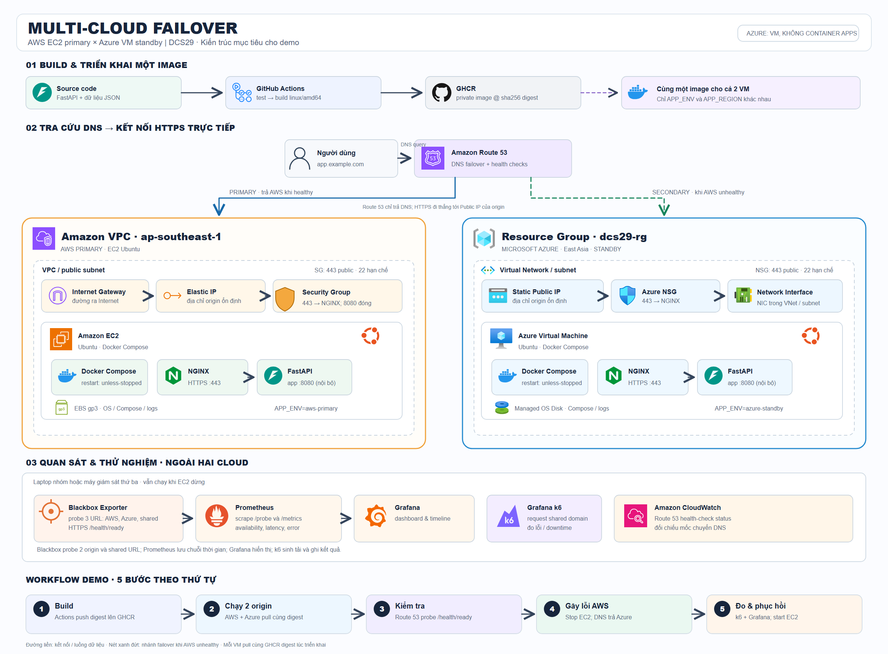

# DCS29 — sơ đồ Multi-Cloud Failover

- Ảnh để chèn báo cáo: [kien-truc-multi-cloud.png](kien-truc-multi-cloud.png)
- Bản SVG chỉnh sửa được: [kien-truc-multi-cloud.svg](kien-truc-multi-cloud.svg)
- Bản cũ để đối chiếu: `kien-truc-multi-cloud-legacy.png/.svg`

## Kiến trúc mục tiêu và workflow demo

1. GitHub Actions test, build image `linux/amd64` và push lên GHCR; lấy **một image digest cố định**.
2. AWS EC2 và Azure Ubuntu VM pull cùng digest, chạy Docker Compose gồm NGINX và FastAPI. Chỉ `APP_ENV` và `APP_REGION` khác. Dữ liệu mẫu đi cùng image. Azure VM nằm trong Resource Group và VNet/subnet, dùng Network Interface, NSG, Static Public IP và Managed OS Disk; AWS dùng VPC/public subnet, Internet Gateway, Security Group, Elastic IP và EBS gp3.
3. Trước demo, **hai VM phải Running** và `/health/ready` của từng origin healthy. Route 53 health check riêng `aws-origin` và `azure-origin` qua HTTPS. Client hỏi DNS tên chung rồi **kết nối trực tiếp** đến origin; request HTTP không đi qua Route 53.
4. Dừng EC2 để mô phỏng AWS lỗi. Khi AWS health check unhealthy và Azure vẫn healthy, Route 53 trả origin Azure cho DNS lookup mới. DNS TTL/cache và connection cũ có thể gây gián đoạn; đo thực tế bằng probe/k6.
5. Blackbox Exporter trên laptop/máy thứ ba probe hai origin và domain chung; Prometheus scrape probe và metrics; Grafana hiển thị timeline; k6 tạo tải và lưu lỗi/latency; CloudWatch cung cấp trạng thái Route 53 health check. Start lại EC2 và quan sát failback.

Sơ đồ thể hiện **kiến trúc mẫu** cho các giai đoạn GĐ4–GĐ8. Nhãn vùng Azure "East Asia" trên hình chỉ là minh họa; khi triển khai, chọn vùng được subscription cho phép và ghi mã thực tế vào `AZURE_REGION` theo [bảng thông số](../docs/giai-doan/THONG_SO_TRIEN_KHAI.md). Kiểm tra từng giai đoạn bằng kết quả của lần triển khai mới; không dùng hình này làm bằng chứng rằng HTTPS, failover hay monitoring đã hoạt động trong tài khoản của bạn. [Hướng dẫn Azure](../docs/giai-doan/GIAI_DOAN_04_AZURE_PORTAL.md#9-kiểm-tra-và-so-sánh-với-aws) · [Route 53 failover](../docs/giai-doan/GIAI_DOAN_06_ROUTE53_FAILOVER.md).

## Nguồn icon

- AWS: [AWS Architecture Icons chính thức](https://aws.amazon.com/architecture/icons/) — EC2, Route 53, VPC, Internet Gateway, Elastic IP, EBS gp3, CloudWatch.
- Azure: [Microsoft Azure Architecture Icons chính thức](https://learn.microsoft.com/en-us/azure/architecture/icons/) — Virtual Machine, Resource Groups, Virtual Networks, Network Security Groups, Public IP Addresses, Network Interfaces, Disks.
- Logo phần mềm: [Simple Icons](https://simpleicons.org/) — GitHub Actions, GitHub (đại diện GHCR), Docker, Ubuntu, NGINX, FastAPI, Prometheus, Grafana và k6. Blackbox Exporter dùng hình radar trung tính vì exporter này không có logo dịch vụ riêng trong bộ icon đã chọn.

Các file nguồn đã chọn nằm ở `images/icons/`; script `scripts/build_multicloud_diagram.py` nhúng chúng vào SVG nên SVG hoạt động độc lập khi sao chép. Chạy `python scripts/build_multicloud_diagram.py` để dựng lại SVG, rồi xuất PNG kích thước 2400×1770 bằng trình duyệt.
